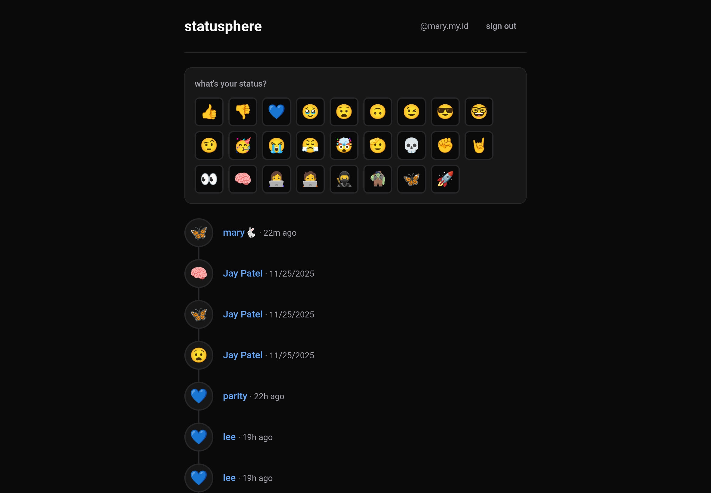

# statusphere

a reimplementation of Bluesky's
[Statusphere example app](https://github.com/bluesky-social/statusphere-example-app), using
[atcute](https://github.com/mary-ext/atcute) and [SvelteKit](https://svelte.dev).



## setup

1. install dependencies:

   ```sh
   pnpm install
   ```

2. set up the environment variables:

   ```sh
   pnpm env:setup
   ```

   this copies the `.env.example` file to `.env` with the following values filled in:
   - `COOKIE_SECRET` - random secret for signing cookies
   - `OAUTH_PRIVATE_KEY_JWK` - ES256 keypair for OAuth

3. start a [Tap](https://github.com/bluesky-social/indigo/tree/main/cmd/tap) instance:

   ```sh
   docker run -p 2480:2480 \
     -e TAP_SIGNAL_COLLECTION=xyz.statusphere.status \
     -e TAP_COLLECTION_FILTERS=xyz.statusphere.status,app.bsky.actor.profile \
     ghcr.io/bluesky-social/indigo/tap:latest
   ```

   Tap handles subscribing to the atproto firehose, backfilling repos, and filtering events. we set
   it up such that it'd backfill all repos that have posted a status, and only emits events for
   status and profile records.

   then configure the Tap connection:

   ```sh
   TAP_URL=http://localhost:2480

   # if configured with a password
   TAP_ADMIN_PASSWORD=
   ```

4. set up a tunnel:

   confidential OAuth clients requires a publicly accessible URL. for local development, you'll need
   to tunnel your local server using a service like [ngrok](https://ngrok.com/) or
   [cloudflared](https://developers.cloudflare.com/cloudflare-one/connections/connect-networks/downloads/).

   once running, set the tunnel URL as your public URL in `.env`:

   ```sh
   OAUTH_PUBLIC_URL=https://your-tunnel-url.example.com
   ```

5. migrate the database:

   ```sh
   pnpm db:migrate
   ```

6. run it!

   ```sh
   pnpm dev
   ```
